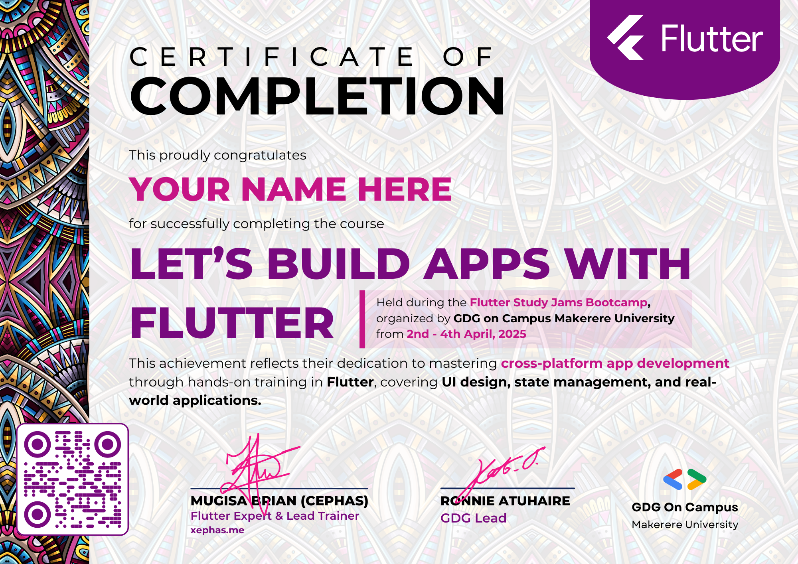

# Flutter Study Jams 2025 Certificates Repository

Welcome to the official repository for certificates awarded during the Flutter Study Jams 2025, Lead by [Mugisa Brian Cephas](xephas.me) and organized by GDG on Campus Makerere University.

## About Flutter Study Jams 2025

The Flutter Study Jams 2025 was an engaging 3-day informative series of Flutter trainings conducted from 2nd - 4th April 2025. The event was designed to help participants learn and master Flutter, a powerful UI toolkit for building natively compiled applications for mobile, web, and desktop from a single codebase. The sessions covered the basics of Flutter, advanced techniques for building complex apps, and much more. We encourage you to explore the resources and videos shared in the [study_jams_25 repository](https://github.com/xephas-official/study_jam_25) to enhance your Flutter skills.

## Certificates

*Certificates look like this*

## Participants Certificates

Certificates were awarded to participants who successfully completed the course **Let's Build Apps with Flutter**. Here is a list of the outstanding individuals who have achieved this milestone:

| Name                     | PNG Certificate | PDF Certificate |
|--------------------------|-----------------|-----------------|
| Asasira Arthur           | [View Certificate][4]     | [Download Certificate PDF][33]     |
| Bwanika Robert           | [View Certificate][8]     | [Download Certificate PDF][37]     |
| Johnson Makmot           | [View Certificate][16]    | [Download Certificate PDF][45]    |
| Kimuli Mayanja Moussa    | [View Certificate][10]    | [Download Certificate PDF][39]    |
| Mariam Wambui            | [View Certificate][17]    | [Download Certificate PDF][46]    |
| Matsiko Ian Sezi         | [View Certificate][18]    | [Download Certificate PDF][47]    |
| Monica Muyama            | [View Certificate][19]    | [Download Certificate PDF][48]    |
| Mwiyikinwa Isaac         | [View Certificate][15]    | [Download Certificate PDF][44]    |
| Stephen Ogwal            | [View Certificate][23]    | [Download Certificate PDF][52]    |
| Wangoda Francis          | [View Certificate][29]    | [Download Certificate PDF][58]    |
| Bashir Kasujja           | [View Certificate][59]    | [Download Certificate PDF][60]    |

Please find the certificates corresponding to each participant above.

Certificates are presented by:

- **Instructor:** [Mugisa Brian Cephas](https://twitter.com/xephas_official)
- **GDG Lead:** [Ronnie Atuhaire](https://x.com/AfroBoyUg)

## How to Access Your Certificate

If your name is on the list above, congratulations! To access your certificate, simply click on your name to download the PDF version or PNG Version. Feel free to showcase your achievement on your portfolio, LinkedIn, or any other professional network.

## How to Verify Your Certificate

To verify the authenticity of your certificate, follow these steps:

- Download the certificate from the list above.
- Scan the QR code on the certificate using a QR code scanner.
- You will be redirected to an e-version of the certificate.

## License

This repository and its contents are licensed under *MIT LICENSE*. See the [LICENSE](https://github.com/capps096github/certificates_flutter_series_23/blob/main/LICENSE.md) file for more details.

Happy coding!

<!-- Image Links according to order of names -->
[1]: images/AMUTUHAIRETRACY.png
[2]: images/AhaabweDerrick.png
[3]: images/ArindaJordan.png
[4]: images/AsasiraArthur.png
[5]: images/BOONABAANABRONIA.png
[6]: images/BagalaZoeAbigail.png
[7]: images/BenOkelloMwaka.png
[8]: images/BwanikaRobert.png
[9]: images/EDYELUANDREW.png
[10]: images/KIMULIMAYANJAMOUSSA.png
[11]: images/KabengeJoelMubuuke.png
[12]: images/KevinZiyadaAseru.png
[13]: images/LinnetKukunda.png
[14]: images/MUHWEZIASAPH.png
[15]: images/MWIYIKINWAISAAC.png
[16]: images/MakmotJohnson.png
[17]: images/MariamWambui.png
[18]: images/MatsikoIanSezi.png
[19]: images/MonicaMuyama.png
[20]: images/MuwanguziAlvinKiggundu.png
[21]: images/NAKUBULWASHADIA.png
[22]: images/NAMULINDWAHANIFAH.png
[23]: images/OGWALSTEPHEN.png
[24]: images/OKEMAPAULMARK.png
[25]: images/SEBUNYARONALDO.png
[26]: images/SSEMAKULAJULIUS.png
[27]: images/SeganeStuart.png
[28]: images/SsekaayiHassan.png
[29]: images/WangodaFrancis.png
[59]: images/BashirKasujja.png

<!-- PDF Links according to order of names -->
[30]: pdf/AMUTUHAIRETRACY.pdf
[31]: pdf/AhaabweDerrick.pdf
[32]: pdf/ArindaJordan.pdf
[33]: pdf/AsasiraArthur.pdf
[34]: pdf/BOONABAANABRONIA.pdf
[35]: pdf/BagalaZoeAbigail.pdf
[36]: pdf/BenOkelloMwaka.pdf
[37]: pdf/BwanikaRobert.pdf
[38]: pdf/EDYELUANDREW.pdf
[39]: pdf/KIMULIMAYANJAMOUSSA.pdf
[40]: pdf/KabengeJoelMubuuke.pdf
[41]: pdf/KevinZiyadaAseru.pdf
[42]: pdf/LinnetKukunda.pdf
[43]: pdf/MUHWEZIASAPH.pdf
[44]: pdf/MWIYIKINWAISAAC.pdf
[45]: pdf/MakmotJohnson.pdf
[46]: pdf/MariamWambui.pdf
[47]: pdf/MatsikoIanSezi.pdf
[48]: pdf/MonicaMuyama.pdf
[49]: pdf/MuwanguziAlvinKiggundu.pdf
[50]: pdf/NAKUBULWASHADIA.pdf
[51]: pdf/NAMULINDWAHANIFAH.pdf
[52]: pdf/OGWALSTEPHEN.pdf
[53]: pdf/OKEMAPAULMARK.pdf
[54]: pdf/SEBUNYARONALDO.pdf
[55]: pdf/SSEMAKULAJULIUS.pdf
[56]: pdf/SeganeStuart.pdf
[57]: pdf/SsekaayiHassan.pdf
[58]: pdf/WangodaFrancis.pdf
[60]: pdf/BashirKasujja.pdf
